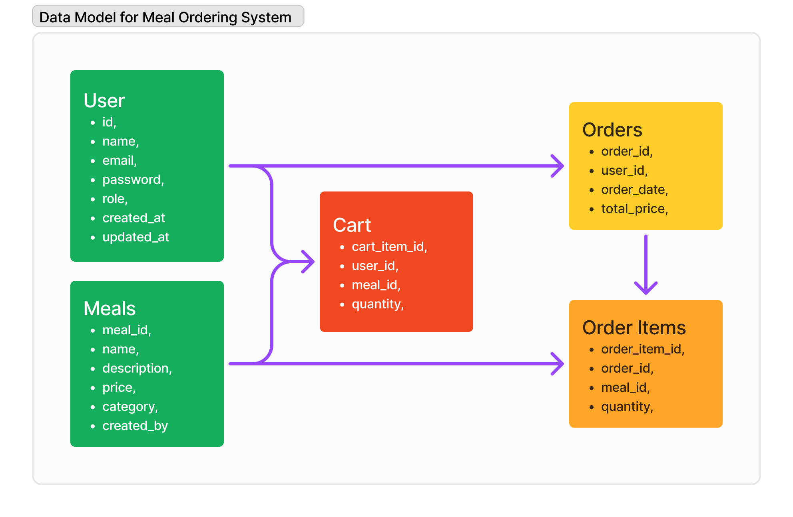

# Final Challenge Explorer 
> 🚧 The database for this project has been disabled.


Welcome to the **Final Challenge Explorer** repository!

This repository contains two main parts of the project: the back-end and the front-end of the **Pizza Store** application, developed as part of the final challenge of the Explorer training at Rocketseat.

## Repository structure

```
final-challenge-explorer
   ├── assets-readme        | assets for readme
   ├── back-pizza-store     | Back-end source code
   └── web-pizza-store      | Front-end source code
```

## Technologies Used

### On Front-End
- **React**: Main library for building the interface.
- **Next.js**: React framework for server-side rendering and optimization.
- **Tailwind CSS**: CSS framework for styles.
- **TypeScript**: Language to ensure static typing.
- **Axios**: Library for making HTTP calls.
- **JWT**: For secure authentication.

### On the Back-End
- **DOCKER-COMPOSE**: For containerization.
- **BCRYPTJS**: Encrypt sensitive data.
- **EXPRESS**: Web framework for Node.js.
- **CORS**: Middleware for enabling CORS.
- **KNEX**: SQL query builder for relational databases.
- **POSTGRES**: Relational database.
- **MULTER**: Middleware for handling multipart/form-data.
- **SWAGGER**: API documentation tool.

### Deployment / Hosting

This project is divided into three main parts: the front-end, back-end (API), and the database. Each part is hosted on different services:

- **Front-end**:
  - **Hosting**: Vercel
  - **Description**: The front-end of the application, which is a React/Next.js app, is hosted on Vercel. Vercel is responsible for continuous deployment of the front-end, automatically generating new versions from the main branch.

- **Back-end (API)**:
  - **Hosting**: Back4App
  - **Description**: The API for this project is hosted on Back4App, which provides support for the Node.js back-end and integrations with database services.

- **Database**:
  - **Hosting**: Render
  - **Description**: The PostgreSQL database is hosted on Render. This service handles the data persistence for the application, providing a secure and scalable environment.


## Description

### back-pizza-store

- Description: API for managing pizza orders, including authentication, CRUD of dishes, and order handling.
- Technologies: Node.js, Express, PostgreSQL, JWT.
- **Documentation**: See [back-pizza-store README](back-pizza-store/README.md) for more details.

### web-pizza-store

- Description: User interface for interacting with the pizza ordering system.
- Technologies: React, Next.js, Tailwind CSS, TypeScript.
- **Documentation**: See [web-pizza-store README](web-pizza-store/README.md) for more details.

## System Architecture and User Flow

### Data Model for Meal Ordering System
This diagram provides a visual representation of how the database entities are structured and how they interact with each other in the **Pizza Store** application.



### User Flow for Order Completion
This flowchart illustrates the user's journey from visiting the homepage, adding items to the cart, logging in, and completing the order process, including delivery and confirmation steps.


## How to get started

1. Clone the repository:
   ```bash
   git clone https://github.com/Frankdias92/final-challenge-explorer
   ```

2. To configure the back-end and front-end, follow the instructions in the respective READMEs.
   - Front-end: [web-pizza-store README](/web-pizza-store/README.md).
   - Back-end: [back-pizza-store README](/back-pizza-store/README.md)

3. Access the deployment of the applications:
   - Front-end: [final-challenge.vercel.app](https://final-challenge-explorer.vercel.app).
   - Back-end: [food-explorer-api](https://backfooddb-fndy852s.b4a.run/meals/index).

## License

This project is licensed under the MIT License. See the [LICENSE](./licence.md) file for more details.
