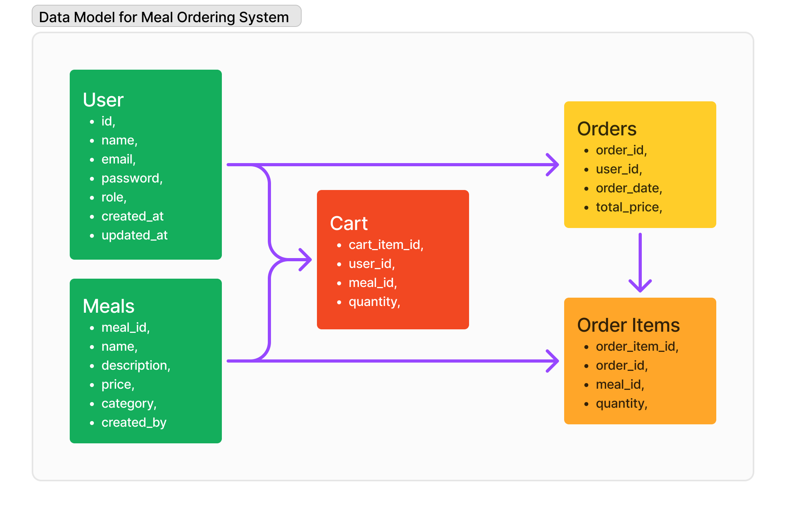

# Pizza Store API

This project is an API for managing a pizza ordering system. It allows administrators to manage meals and users, and customers to place and manage orders.

##  Table of Contents
- [Features](#features)
- [Installation](#installation)
- [Usage](#usage)
- [API Endpoints](#api-endpoints)
- [Project Structure](#project-structure)
- [Database Schema](#database-schema)
- [Running Migrations](#running-migrations)
- [Environment Variables](#environment-variables)
- [API Documentation](#api-documentation)

### Data Model for Meal Ordering System
This diagram provides a visual representation of how the database entities are structured and how they interact with each other in the **Pizza Store** application.



##  Features
- **User Management**: Create, read, update, and delete users. Differentiate between admin and customer roles.
- **Meal Management**: Admins can create, read, update, and delete meals.
- **Order Management**: Users can place orders, view their orders, and manage order items.
- **Order Items Management**: Manage the relationship between orders and meals.

## 🛠 Installation
### Config Environment Variables
- Rename file `.env.example` to `.env`

- Let's run this command below to create a container:
    ```sh
    docker-compose up -d
    ```
- Check if it is running:
    ```sh
    docker-compose ps
    ```    
- You should see this if everything goes well:

 

- API is available at [http://localhost:3333](http://localhost:3333) after starting the server.

## 📡 API Endpoints
### Users
- `POST /users`: Create a new user.
- `GET /users`: Get all users.
- `GET /users/:id`: Get a specific user by ID.
- `PUT /users/:id`: Update a specific user by ID.
- `DELETE /users/:id`: Delete a specific user by ID.

### Meals
- `POST /meals`: Create a new meal.
- `GET /meals`: Get all meals.
- `GET /meals/:id`: Get a specific meal by ID.
- `PUT /meals/:id`: Update a specific meal by ID.
- `DELETE /meals/:id`: Delete a specific meal by ID.

### Orders
- `POST /orders`: Create a new order.
- `GET /orders`: Get all orders.
- `GET /orders/:id`: Get a specific order by ID.
- `PUT /orders/:id`: Update a specific order by ID.
- `DELETE /orders/:id`: Delete a specific order by ID.

### Order Items
- `POST /order_items`: Create a new order item.
- `GET /order_items`: Get all order items.
- `GET /order_items/:id`: Get a specific order item by ID.
- `PUT /order_items/:id`: Update a specific order item by ID.
- `DELETE /order_items/:id`: Delete a specific order item by ID.

### Cart
- `POST /cart`: Add item to cart.
- `GET /cart`: Get all items in the cart.
- `PUT /cart/:id`: Update a specific cart item.
- `DELETE /cart/:id`: Remove a specific cart item.

##  Project Structure

<details>
<summary> 
 Click to expand 
</summary>

```
project-root/
├── bin/
│   └── sh/
│       └── start.sh
├── src/
│   ├─── configs/
│   │   ├── auth.js
│   │   └── upload.js
│   ├─── controllers/
│   │   ├── MealsController.js
│   │   ├── UsersController.js
│   │   ├── OrdersController.js
│   │   ├── OrderItemsController.js
│   │   └── CartController.js
│   ├─── database/
│   │   ├─── knex/
│   │   │   ├─── migrations/
│   │   │   │   ├── createCartItems.js
│   │   │   │   ├── createMeals.js
│   │   │   │   ├── createOrderItems.js
│   │   │   │   ├── createOrders.js
│   │   │   │   └── createUsers.js
│   │   │   └── index.js
│   └── database.db
│   ├─── docs/
│   │   ├─── schemas/
│   │   │   ├── cart.js
│   │   │   ├── index.js
│   │   │   ├── meals.js
│   │   │   ├── order_items.js
│   │   │   ├── orders.js
│   │   │   ├── sessions.js
│   │   │   └── user.js
│   ├─── middlewares/
│   │   ├── cartRoutesvalidate.js
│   │   ├── ensureAuthenticated.js
│   │   └── verifyAuthorization.js
│   ├─── providers/
│   │   └── DiskStorage.js
│   ├─── routes/
│   │   ├── cart.routes.js
│   │   ├── index.js
│   │   ├── meals.routes.js
│   │   ├── orderItems.routes.js
│   │   ├── orderMeals.routes.js
│   │   ├── sessions.routes.js
│   │   └── users.routes.js
│   ├─── utils/
│   │   └── AppError.js
│   ├── server.js
│   └── swagger.js
├── .env
├── .gitignore
├── Dockerfile
├── docker-compose.yml
├── insomnia_routes.json
├── knexfile.js
├── package-lock.json
├── package.json
├── README.md
├── swagger-output.json
└── swagger.json
```
</details>

### Database Schema
The database consists of the following tables:

### Users Table
| Column Name | Data Type | Description |
| ---------------- | ---------------- | -------------------------------------- |
| id | INTEGER | Primary key |
| name | TEXT | User's name |
| email | TEXT | User's email (must be unique) |
| password | TEXT | User's encrypted password |
| role | ENUM ("admin", "customer") | User's role, default is "customer" |
| created_at | TIMESTAMP | Timestamp when the user was created |
| updated_at | TIMESTAMP | Timestamp when the user was last updated |

### Meals Table
| Column Name | Data Type | Description |
| ---------------- | ---------------- | -------------------------------------- |
| meal_id | INTEGER | Primary key |
| name | TEXT | Name of the meal |
| description | TEXT | Description of the meal |
| price | DECIMAL (10, 2) | Price of the meal |
| category | TEXT | Category of the meal |
| created_by | INTEGER | Foreign key to users table (references id) |

### Orders Table
| Column Name | Data Type | Description |
| ---------------- | ---------------- | -------------------------------------- |
| order_id | INTEGER | Primary key |
| user_id | INTEGER | Foreign key to users table (references id) |
| order_date | TIMESTAMP | Timestamp when the order was placed |
| total_price | DECIMAL (10, 2) | Total price of the order |

### Order Items Table
| Column Name | Data Type | Description |
| ---------------- | ---------------- | -------------------------------------- |
| order_item_id | INTEGER | Primary key |
| order_id | INTEGER | Foreign key to orders table (references order_id) |
| meal_id | INTEGER | Foreign key to meals table (references meal_id) |
| quantity | INTEGER | Quantity of the meal ordered |


## Environment Variables
To run this project, you will need to rename the file `.env.exemple` environment to `.env`

## API Documentation
- Swagger is available at [http://localhost:3333/api-docs](http://localhost:3333/api-docs) after starting the server.

## License

This project is licensed under the MIT License. See the [LICENSE](../licence.md) file for more details.
